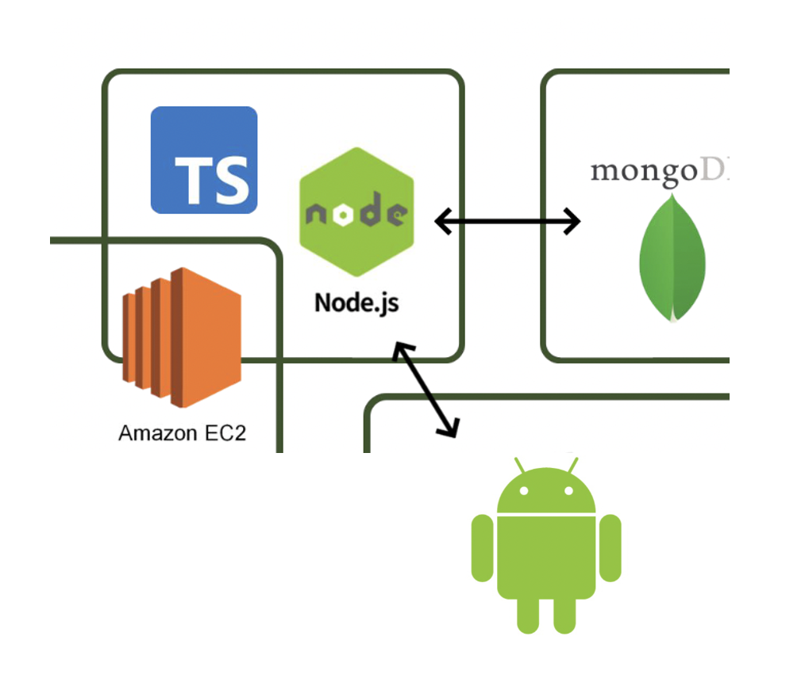

## 서비스 이름과 간단한 소개

---

- 서비스명 : 로그인유(LOG:IN U)
- 서비스 한 줄 소개 : 타인의 일상을 살아보는 서비스

  

---

## 각자 개발 담당 부분

---

- 지윤 : 모든 일상 조회, 일상 담기, 내가 담은 일상 전체 조회, 미션 체크
- 서우 : 내 일상 등록, 내가 등록한 일상 조회
  > API 명세서 링크: <https://www.notion.so/API-DOCS-8271f96a1202407abe12aec51b1c5e36>

  

## 브랜치 전략

---

- `main` : 메인 브랜치
- `main`에 직접적인 commit, push는 가급적 금지합니다
- 작업 전, 반드시 `main` 브랜치를 pull 받고 시작합니다
  `git pull origin main`
- 기능 개발 시 `feature/기능` 브랜치를 파서 관리합니다
  `git branch feature/기능`
- 작은 기능별로 `commit message rules`에 따라 커밋을 진행합니다
- 작업 완료 시 `main` 브랜치로 Pull Request를 보냅니다
- 팀원과 코드리뷰를 진행한 후, 최종적으로 `main` 브랜치로 merge합니다
- 다 쓴 브랜치는 삭제합니다

  

## 프로젝트 폴더링

- -

* 지윤 : 모든 일상 조회, 일상 담기, 내가 담은 일상 전체 조회, 미션
* 서우 : 내 일상 등록, 내가 등록한 일상 조회

## API DOCS

> API 명세서 링크: <https://www.notion.so/API-DOCS-8271f96a1202407abe12aec51b1c5e36

  

## 브랜치 전략

- `main` : 메인 브랜치
- `main`에 직접적인 commit, push는 가급적 금지합니다
- 작업 전, 반드시 `main` 브랜치를 pull 받고 시작합니다
  `git pull origin main`
- 기능 개발 시 `feature/기능` 브랜치를 파서 관리합니다
  `git branch feature/기능`
- 작은 기능별로 `commit message rules`에 따라 커밋을 진행합니다
- 작업 완료 시 `main` 브랜치로 Pull Request를 보냅니다
- 팀원과 코드리뷰를 진행한 후, 최종적으로 `main` 브랜치로 merge합니
- 다 쓴 브랜치는 삭제합니다

  

## 프로젝트 폴더링

<pre>
<code>
📦 config                    // port, mongoURI 등 설정
 ┗ 📜 index.ts

📦 controllers               // service에서 처리된 로직들을 전달 받아 response해줌
 ┣ 📜 index.ts
 ┗ 📜 ProjectController.ts

📦 interfaces                // type interface 정의
 ┗ 📂 common
 ┃ ┣ 📜 PostBaseResponseDto.ts
 ┃ ┗ 📜 JwtPayloadInfo.ts
 ┗ 📂 project
   ┣ 📜 ProjectInfo.ts
   ┗ 📜 ProjectCreateDto.ts

📦 loaders              
 ┗ 📜 db.ts

📦 middlewares         
 ┗ 📜 auth.ts            

📦 models                    // mongoose.Schema 정의
 ┗ 📜 Project.ts

📦 modules                 
 ┣ 📜 jwtHandler.ts
 ┗ 📜 util.ts 
 ┗ 📜 statusCode.ts
 ┗ 📜 responseMessage.ts

📦 routes                    // endpoint 정의
 ┣ 📜 index.ts
 ┗ 📜 ProjectRouter.ts 

📦 services                  // 상세 구현, controller로 전달 됨
 ┣ 📜 index.ts
 ┗ 📜 ProjectService.ts
</code>

</pre>

## 아키텍처

</img>

## models

<pre>
<code>
{
  
const DailySchema = new mongoose.Schema({
dailyName: {
type: String,
required: true,
},
userId: {
type: Number,
required: true,
},
userName: {
type: String,
},
missions: {
type: Array,
},
});

const UserMissionSchema = new mongoose.Schema({
userId: {
type: Number,
required: true,
},
userName: {
type: String,
},
dailyId: {
type: mongoose.Types.ObjectId,
required: true,
ref: 'Daily',
},
completeMissions: {
type: Array,
},
});}
</code>
</pre>

## package.json

---

<pre>
<code>
{
  {
  "name": "node-typescript-init",
  "version": "1.0.0",
  "description": "",
  "main": "index.js",
  "scripts": {
    "dev": "nodemon",
    "build": "tsc && node dist"
  },
  "author": "",
  "license": "ISC",
  "devDependencies": {
    "@types/express": "^4.17.13",
    "@types/mongoose": "^5.11.97",
    "@types/node": "^17.0.25",
    "nodemon": "^2.0.15",
    "ts-node": "^10.7.0",
    "typescript": "^4.6.3"
  },
  "dependencies": {
    "dotenv": "^16.0.0",
    "express": "^4.17.3",
    "express-validator": "^6.14.0",
    "mongoose": "^6.3.1"
  }
}

}
</code>
</pre>
